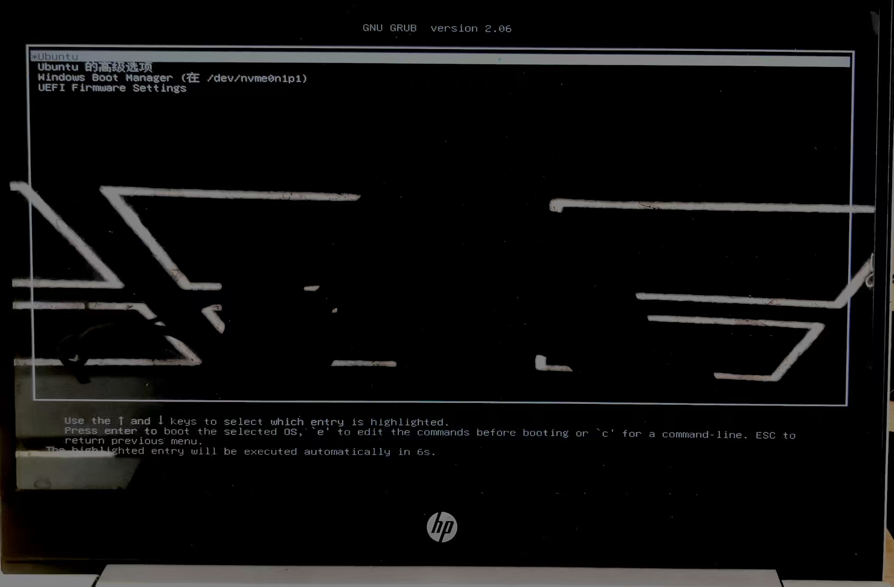

# Week1 实验报告：双系统安装与开发环境搭建

> **姓名**：陈一诺
> **学号**：2023020101
> **日期**：2025年12月5日
> **GitHub仓库**：`https://github.com/2025BIUHcourse/week1-ChryschtterlingUrban`

## 1. 实验任务
本周的核心任务是搭建后续自动驾驶项目所需的开发环境，具体包括：
1. 在计算机上安装 **Windows 11 + Ubuntu 20.04** 双系统。
2. 在Ubuntu系统中安装并配置 **VSCode** 编辑器及C++开发环境。
3. 学习 **Git** 基础操作，并在GitHub创建仓库、提交本周作业。
4. 学习使用 **Markdown** 语法编写规范的实验报告。

## 2. 实现过程（含主要步骤与截图）
### 2.1 双系统安装（Windows 11 + Ubuntu 20.04）
**主要步骤**：
   - **准备工作**：下载Ubuntu 20.04镜像，使用Rufus工具制作启动U盘。
   - **磁盘分区**：在Windows的“磁盘管理”中，从C盘压缩出约100GB的未分配空间。
   - **BIOS设置**：重启电脑进入BIOS，关闭`Secure Boot`，调整启动顺序为U盘优先。
   - **安装Ubuntu**：从U盘启动，选择“试用Ubuntu”，然后点击桌面图标开始安装。在**“安装类型”**中选择 **“其他选项”**，对之前压缩出的未分配空间进行手动分区：<br> 根分区（/）100GB， 文件系统`ext4`
   - **完成安装**：设置用户名密码，等待安装完成，重启后即出现GRUB双系统选择菜单。

**截图**：
（Ubuntu 系统安装日志、Windows + Ubuntu 双系统启动菜单截图、Ubuntu桌面截图）




### 2.2 VSCode安装与C++环境配置
**主要步骤**：
1. **安装VSCode**：在Ubuntu软件中心搜索`Visual Studio Code`并安装，或通过终端命令安装。
2. **安装扩展插件**：在VSCode中安装`C/C++`扩展（Microsoft发布）和`Markdown All in One`扩展。
3. **安装编译工具**：打开终端，安装GCC/G++编译器。
   ```bash
   sudo apt update
   sudo apt install build-essential

## 3. 遇到的问题与解决方法
### 问题1：无法从启动菜单识别 Ubuntu 安装U盘
**解决**：进入 BIOS 设置，关闭 `Secure Boot`，并将启动模式调整为 `UEFI with Legacy`。之后成功识别。
### 问题2：在 VSCode 中运行 C++ 程序时，提示“选择调试配置”
**解决**：选择 **`C/C++: g++ 生成和调试活动文件`**。VSCode 自动生成了 `launch.json` 和 `tasks.json` 配置文件，之后即可正常调试。
### 问题3：修改 C++ 代码后，运行结果未改变
**解决**：意识到**修改源代码后必须重新编译**。再次执行 `g++ hello.cpp -o hello` 命令后，运行结果更新。

## 4. 总结与心得
通过本周实践，我掌握了以下核心技能与概念：
1. **系统层面**：理解了磁盘分区、系统引导（GRUB）的基本概念，具备了双系统故障排查能力。
2. **开发环境**：熟悉了在 Linux 环境下使用命令行安装软件、配置开发工具（VSCode）的流程。
3. **编程基础**：明确了源代码编辑、编译、运行的全流程，理解了编译器 (`g++`) 的作用。
4. **工具链**：接触了 Git 版本控制和 Markdown 文档编写，为后续项目协作和报告提交奠定了基础。